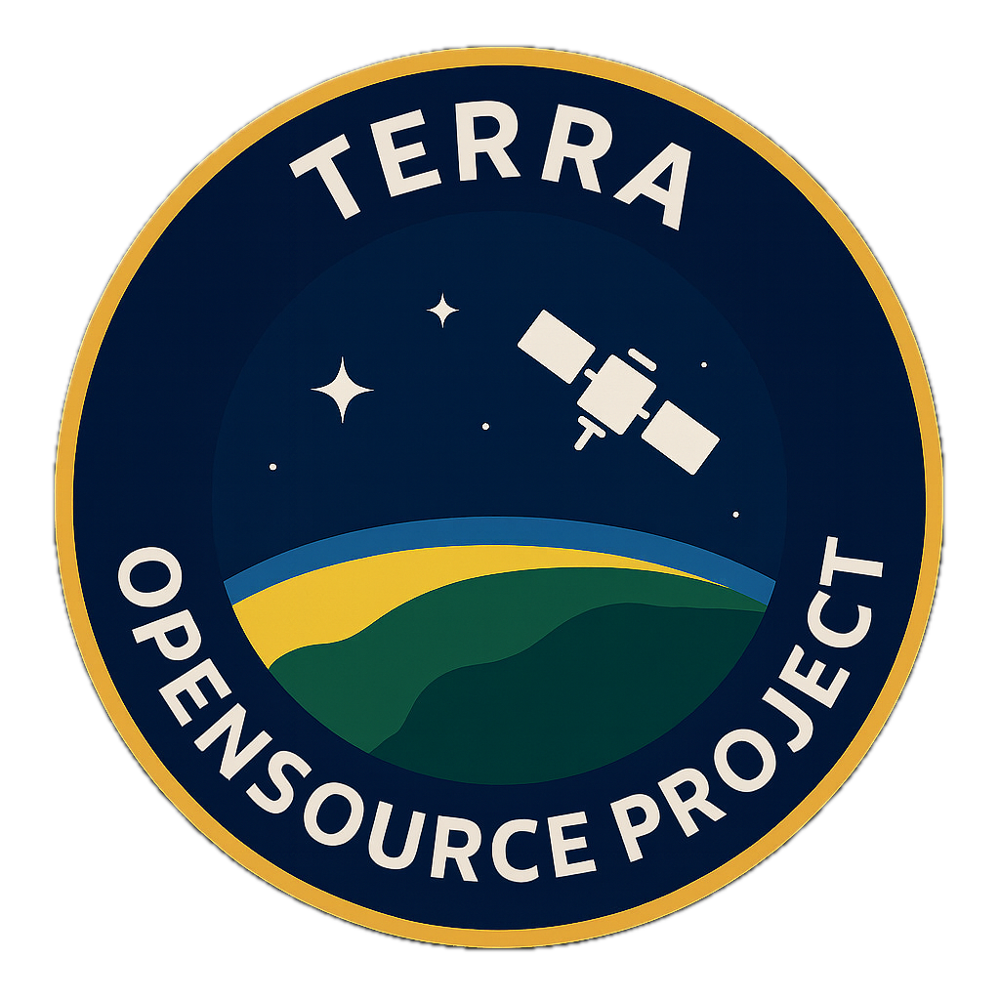
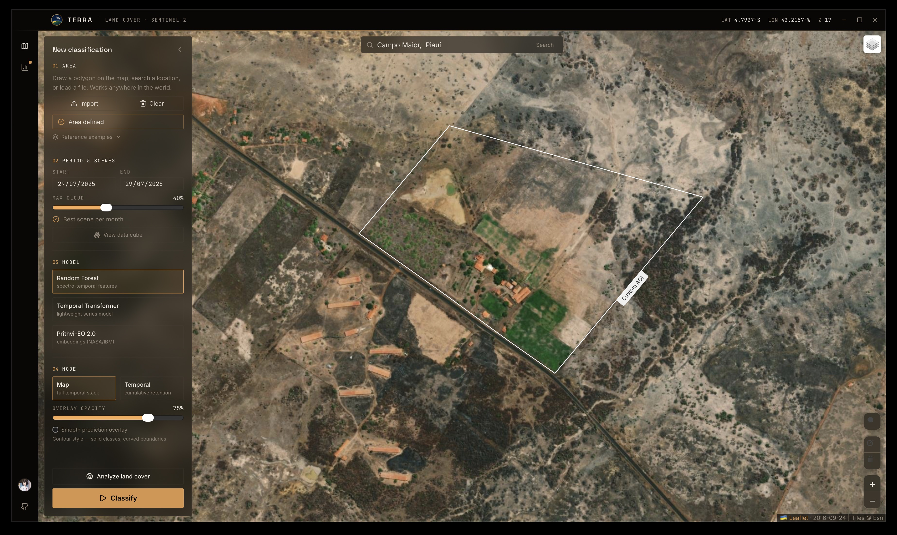
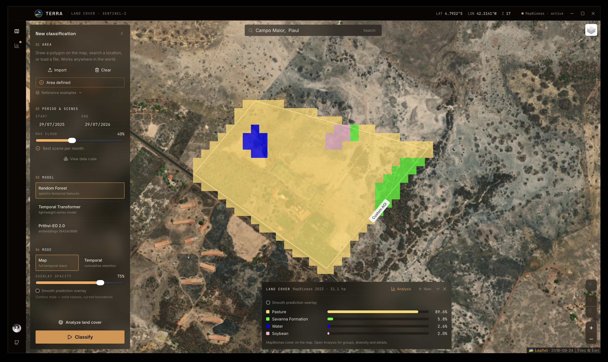
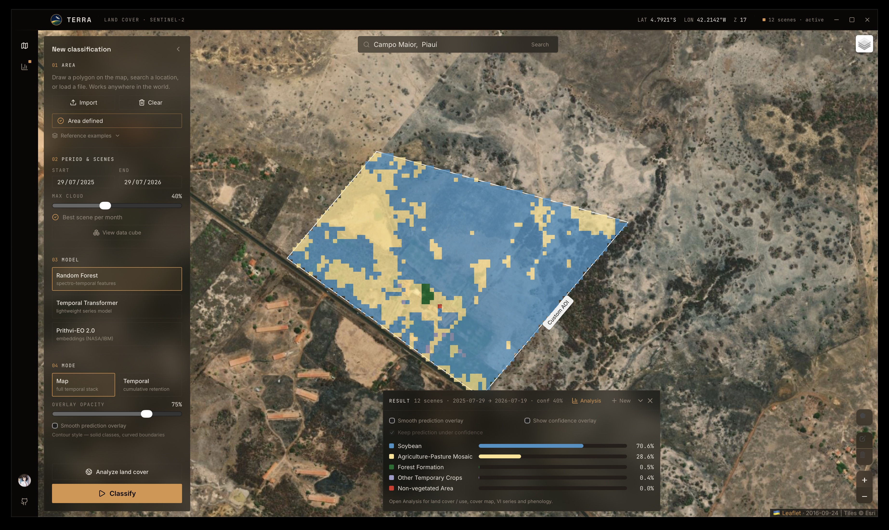
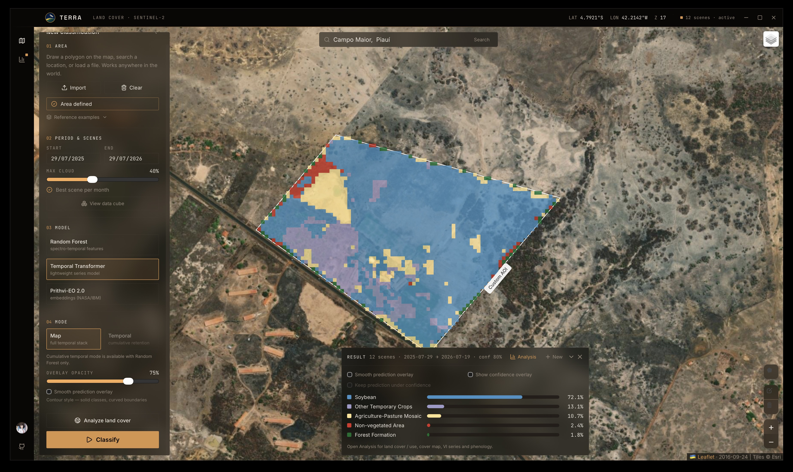
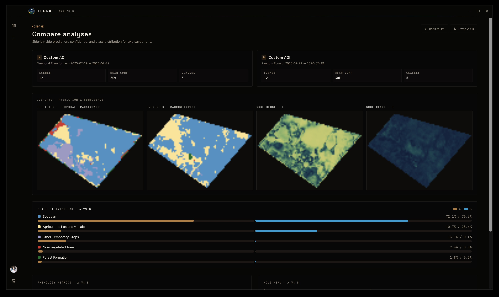

# TERRA

<p align="center">
  
</p>

Desktop application for land-cover classification from Sentinel-2 time series.
Draw or import an area of interest, preview scenes, run a classifier, and inspect prediction overlays, confidence, phenology, and saved analyses — including side-by-side comparison of two runs.

Imagery is read on demand from the Sentinel-2 L2A STAC catalog (Microsoft
Planetary Computer) as Cloud-Optimized GeoTIFFs — only the polygon window and the
required bands are fetched, so no full product download is required.

The spectral Random Forest path reproduces the method described in:

> Melo, J. L. S., Magalhães, D. K., Kolodziej, J. E., Kuhn, E. V.
> *Automatic Land Cover Classification with Sentinel-2 and MapBiomas Time
> Series.* XLIV Brazilian Symposium on Telecommunications and Signal Processing
> (SBrT 2026), Salvador, BA, Brazil.

<p align="center">
  
</p>

<p align="center"><em>Map workspace — AOI, period, model, and Classify</em></p>

## Overview

- Select any area: draw a polygon, search a location, or import a KML/GeoJSON
  file. Three validated study areas from the reference work are included as
  examples.
- Choose an acquisition period and a maximum cloud cover. By default one scene
  per month (lowest cloud cover) is selected; optionally preview the Sentinel-2
  data cube before classifying.
- Run **Random Forest** (spectro-temporal features), **Temporal Transformer**,
  or **Prithvi-EO 2.0** embeddings (NASA/IBM), in map or temporal mode.
- Inspect prediction and confidence overlays, MapBiomas reference layers, class
  statistics, vegetation indices, and phenology.
- Save analyses locally and **compare two runs** side by side (overlays, class
  distribution, phenology / NDVI when available).

## Gallery

| MapBiomas reference | Random Forest | Temporal Transformer |
|:-------------------:|:-------------:|:--------------------:|
|  |  |  |

<p align="center">
  
</p>

<p align="center"><em>Compare mode — prediction and confidence for two saved analyses</em></p>

## Download

Prebuilt desktop bundles for macOS, Windows, and Linux are attached to each
[release](https://github.com/rexionmars/geosense/releases).

> **Runtime requirement.** The TERRA bundles include the UI and the trained model but
> run inference through a local Python 3.12 with `rasterio`, `scikit-learn`,
> `pyproj`, `shapely`, `joblib`, `numpy`, `pystac-client`, and
> `planetary-computer`. If that interpreter is not on `PATH`, point TERRA at it
> with the `GEOSENSE_PYTHON` environment variable. See
> [Requirements](#requirements) and [Configuration](#configuration).

## Architecture

```
TERRA/
├── main.go              Wails window (frameless, dark), go:embed, bindings
├── app.go               Methods exposed to the frontend
├── backend/
│   ├── sidecar.go       Resolves paths, runs the Python sidecar, streams progress
│   ├── geocode.go       OSM Nominatim location search
│   └── types.go         Request/result types
├── sidecar/
│   └── infer.py         Inference pipeline (STAC discovery, features, models, overlay)
├── model/               Trained classifier artifacts (.joblib / .pt)
├── areas/               Embedded example polygons (GeoJSON)
├── docs/img/            README screenshots and project mark
└── frontend/            React 19 + Vite 7 + Tailwind 4 + Leaflet
```
The Go shell renders a native WebView and bridges to a Python sidecar via
subprocess (JSON over stdin/stdout). The sidecar reproduces the notebook
pipeline so inference matches the reference results. Bands are read remotely with
GDAL `/vsicurl`; features are computed in Python; model weights are loaded from
`model/`.

### Stack

| Layer     | Technology |
|-----------|------------|
| Shell     | Wails v2 (Go) |
| Frontend  | React 19, Vite 7, TypeScript 5.9, Tailwind CSS 4 |
| Map       | Leaflet, react-leaflet 5, leaflet-draw |
| Charts    | Recharts |
| Motion    | Motion (Framer Motion) |
| Inference | Python 3.12, scikit-learn, rasterio, pyproj, shapely, pystac-client, planetary-computer |

## Requirements

- Go 1.23+
- Node.js 18+
- Python 3.12 with the inference dependencies: `rasterio`, `scikit-learn`,
  `pyproj`, `shapely`, `joblib`, `numpy`, `pystac-client`, `planetary-computer`
- For the Prithvi model only: `torch` and `terratorch` (`>=1.2`)
- [Wails CLI](https://wails.io): `go install github.com/wailsapp/wails/v2/cmd/wails@latest`

The Python interpreter is resolved in this order: `GEOSENSE_PYTHON`, a `.venv` at
the repository root, then `python3` on `PATH`.

## Development

```bash
wails dev
```

Starts Vite with hot reload and the Go backend with the bridge bindings.

## Testing

Automated tests cover the SQLite store, area/model path resolution, vegetation
indices, phenology, LULC metrics, and a smoke load of the spectral Random Forest
artifacts. They run offline (no Planetary Computer / network) and are executed
on every push and pull request to `main` via GitHub Actions.

```bash
go test ./backend/...

pip install -r requirements-dev.txt
pytest sidecar/tests -q
```

## Build

```bash
wails build
```

Produces a native application bundle under `build/bin/` (e.g. `TERRA.app` on macOS).

## Configuration

Path resolution can be overridden with environment variables (legacy `GEOSENSE_*` names):

| Variable             | Purpose |
|----------------------|---------|
| `GEOSENSE_PYTHON`    | Python interpreter used to run the sidecar |
| `GEOSENSE_APP_DIR`   | Directory containing `sidecar/`, `areas/`, `model/` |
| `GEOSENSE_MODEL_DIR` | Trained model directory (defaults to `model/`) |

## Models

Classifiers selectable in the app:

### Spectral Random Forest (default)

```
rf_classifier.joblib   Random Forest (300 trees)
scaler.joblib          StandardScaler for the 80 features
label_encoder.joblib   MapBiomas class encoder
feature_names.joblib   Ordered feature names (80)
```

Each pixel is described by 80 spectro-temporal features: 14 temporal statistics
for each of NDVI, EVI, and SAVI; 4 statistics per spectral band (B02, B03, B04,
B08); and the raw NDVI series. Reproduces the reference work.

### Temporal Transformer

Lightweight series model over the Sentinel-2 temporal stack; produces a cover map
and confidence layer comparable to the Random Forest path in the Analysis and
Compare views.

### Prithvi-EO 2.0 embeddings

```
prithvi_rf_pixel.joblib    Random Forest on per-pixel embeddings
prithvi_rf_patch.joblib    Random Forest on per-patch embeddings
prithvi_scaler_{pixel,patch}.joblib
prithvi_label_encoder.joblib
```

Uses the frozen [Prithvi-EO 2.0 300M](https://huggingface.co/ibm-nasa-geospatial/Prithvi-EO-2.0-300M)
geospatial foundation model (NASA/IBM) as an encoder over six Sentinel-2 bands
(B02, B03, B04, B8A, B11, B12), with a Random Forest head trained on its 1024-d
embeddings. Two granularities are available: `pixel` (each pixel encoded
independently, 10 m, comparable to the spectral model) and `patch` (each 16×16
patch encoded with spatial context, ~160 m). The backbone weights (~1.2 GB) are
downloaded from the Hugging Face Hub on first use and cached. This path requires
`terratorch` and `torch`; on Apple Silicon it runs on MPS. Temporal soybean
retention is available only for the spectral model.

To retrain the Prithvi heads, see `sidecar/train_prithvi.py`.

Models must be loaded with a scikit-learn version compatible with the one used
for serialization.

## Data sources

Sentinel-2 L2A scenes are read from the
[Microsoft Planetary Computer](https://planetarycomputer.microsoft.com/) STAC
catalog. Access is anonymous (URLs are signed automatically). Location search
uses [OpenStreetMap Nominatim](https://nominatim.openstreetmap.org/). Basemap
tiles include Esri World Imagery and EOX Sentinel-2 cloudless 2025.

## License

MIT. See [LICENSE](LICENSE).
