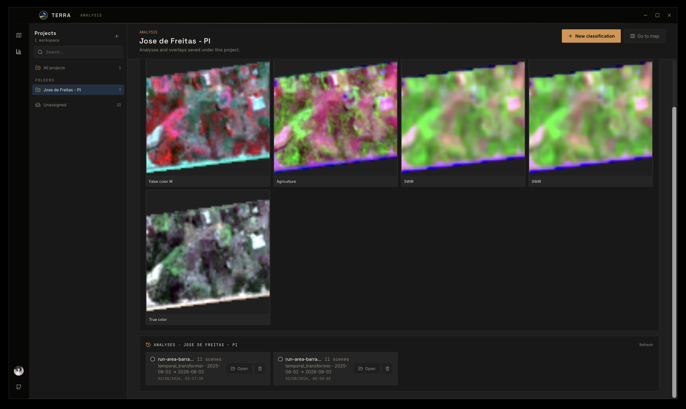
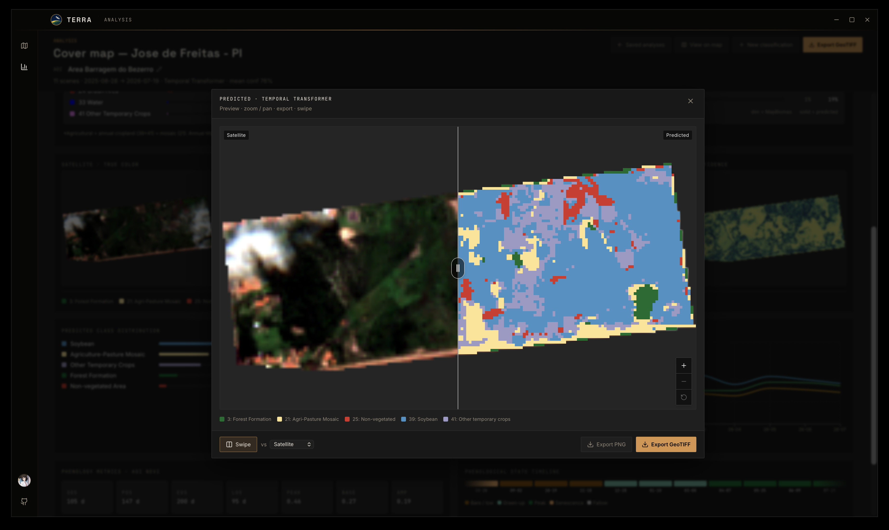
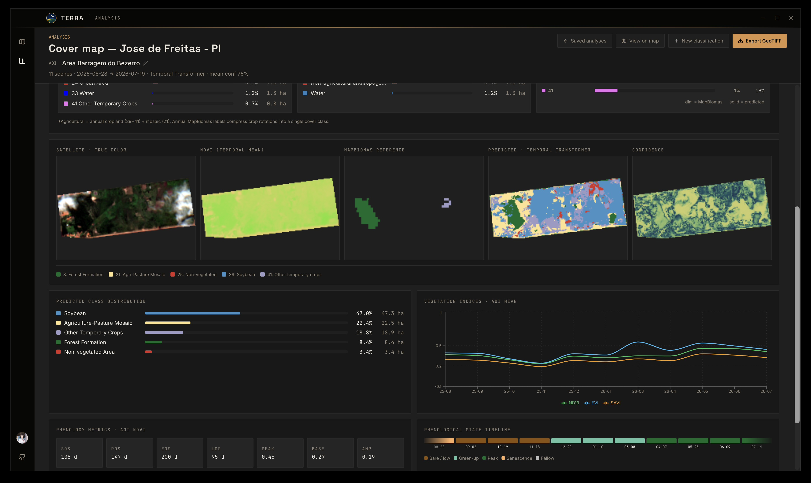
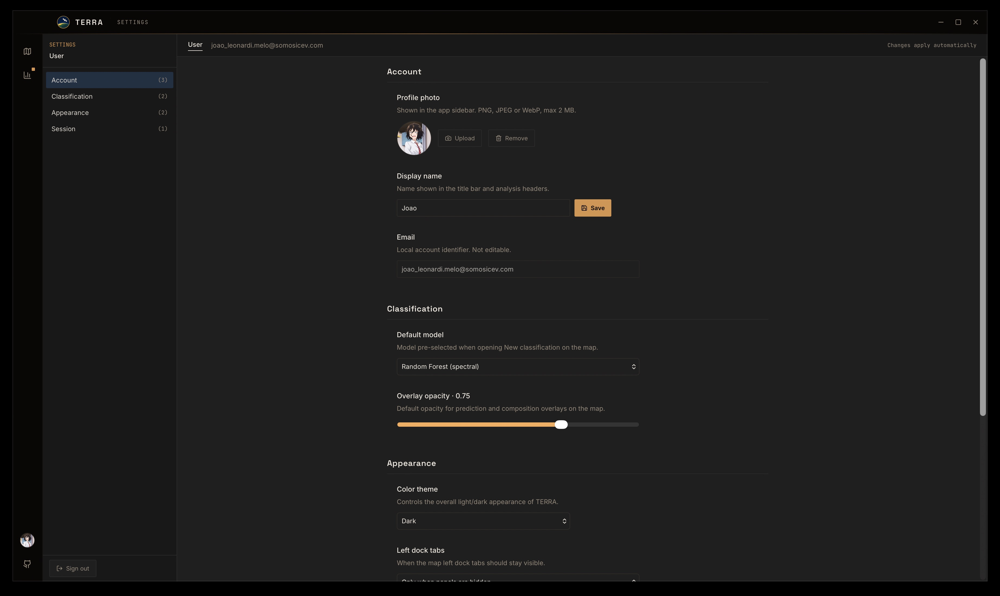

# TERRA

<p align="center">
  
</p>

Desktop application for land-cover classification from Sentinel-2 time series.
Draw or import an area of interest, organize work in **Projects**, preview
band **compositions**, run a classifier, manage overlays from **Overlay Tools**,
and inspect prediction confidence, phenology, and saved analyses — including
side-by-side **Compare** of two runs. After updates, a **What’s New** modal
summarizes product changes.

Imagery is read on demand from the Sentinel-2 L2A STAC catalog (Microsoft
Planetary Computer) as Cloud-Optimized GeoTIFFs — only the polygon window and the
required bands are fetched, so no full product download is required.

The spectral Random Forest path reproduces the method described in:

> Melo, J. L. S., Magalhães, D. K., Kolodziej, J. E., Kuhn, E. V.
> *Automatic Land Cover Classification with Sentinel-2 and MapBiomas Time
> Series.* XLIV Brazilian Symposium on Telecommunications and Signal Processing
> (SBrT 2026), Salvador, BA, Brazil.

## Research methods and feature requests

TERRA is an open-source Earth Observation platform developed alongside an ongoing
academic research program, spanning undergraduate research, a Master's degree,
and future doctoral work. Rather than being software-driven, the project is
research-driven: the platform serves as a vehicle for investigating, developing,
validating, and disseminating new methods that can ultimately improve practical
Earth Observation and remote sensing workflows—a place where research ideas can
be experimentally evaluated, refined, and eventually translated into tools that
support real-world Earth Observation practice.

Research capabilities—such as crop classification pipelines, change detection,
image segmentation, topography-related workflows, canopy diagnostics, and other
advanced Earth Observation methods—are not incorporated directly from published
papers. Instead, they are developed through a complete research cycle involving
problem formulation, literature review, scientific investigation, hypothesis
development, experimental prototyping, algorithm design, validation, and
iterative refinement. Existing methods from the literature are critically
analyzed, adapted when appropriate, compared against alternative approaches,
and, where possible, extended with new ideas before becoming part of the
platform.

These research modules are maintained in a private research repository while
they are under active investigation. Only after reaching an appropriate level of
scientific maturity, reproducibility, technical validation, documentation, and
usability are they exported and integrated into the public desktop application.

Two longer user manuals (one for a general audience and one for academic /
research users, covering methods, model development, and validation) and related
scientific research reports are being prepared in Overleaf. Until they are
published, use the short [User guide](docs/USER_GUIDE.md) below.

If you would like to discuss research directions or request features in these
domains (e.g. crop classification, change detection, segmentation, canopy
diagnostics, or other Earth Observation methods), please contact
**[joao_leonardi.melo@somosicev.com](mailto:joao_leonardi.melo@somosicev.com)**
or **[opensource.leonardi@gmail.com](mailto:opensource.leonardi@gmail.com)**.
GitHub Issues should be reserved for bug reports, feature requests, and
improvements related to functionality already available in the public project.

<p align="center">
  
</p>

<p align="center"><em>Map workspace — classify an AOI, then manage overlays in Overlay Tools</em></p>

## Statement of need

Researchers and practitioners who study agricultural land cover often need
**reproducible, AOI-scale classification** from Sentinel-2 without scripting a
full Earth Engine or desktop GIS pipeline for every farm. Common gaps:

- Notebook-only workflows are hard to hand to collaborators who want a map UI.
- Full scene downloads are heavy when only a small polygon matters.
- Comparing models (classical RF vs transformers vs foundation-model embeddings)
  usually means separate scripts and ad-hoc overlays.

**TERRA** targets remote-sensing and agronomy researchers (and students) who
want a local desktop tool that: clips COGs on demand, runs published-style
spectro-temporal Random Forest (and optional deep models), inspects confidence /
phenology / MapBiomas context, and saves or compares runs — without a cloud
account for the app itself.

## Documentation

| Doc | Contents |
|-----|----------|
| [User guide](docs/USER_GUIDE.md) | AOI → Projects → classify → Overlay Tools → Analysis → Compare |
| User manuals & reports (in preparation) | General + academic manuals and research reports (drafted in Overleaf) |
| [Install](docs/INSTALL.md) | LITE vs FULL releases, Python env, from-source |
| [Releasing](docs/RELEASING.md) | SemVer tags, when to bump, when not to release |
| [Roadmap](docs/ROADMAP.md) | Planned packaging and analysis features |
| [Architecture](docs/ARCHITECTURE.md) | Wails shell, sidecar, STAC/COG design |
| [API](docs/API.md) | Go bindings and sidecar JSON contracts |
| [Troubleshooting](docs/TROUBLESHOOTING.md) | Python, STAC, models, macOS |
| [Contributing](CONTRIBUTING.md) | Issues, PRs, tests |
| [Design](docs/DESIGN.md) | Visual identity tokens |

## Quick start

1. Prefer a **FULL** release zip (embeds Python) — or install Python 3.12 +
   `pip install -r requirements.txt` for **LITE** (see [Install](docs/INSTALL.md)).
2. Download from [releases](https://github.com/rexionmars/TERRA/releases) **or** run `wails dev` from source.
3. Open TERRA (set `GEOSENSE_PYTHON` only if using LITE / a custom interpreter).
4. Create or open a **Project**, set an AOI (embedded area **A**, draw, or import),
   pick a seasonal date range, model **spectral**, then **Classify**.
5. Use **Overlay Tools** (top-right) for prediction/composition visibility, swipe,
   opacity, and export — then open **Analysis** for cover map, VI, and phenology.

Full walkthrough: [docs/USER_GUIDE.md](docs/USER_GUIDE.md).

## Overview

- Organize work in **Projects** (AOI name vs inference **run-*** labels stay
  separate); switch projects from the title bar.
- Select any area: draw a polygon, search a location, or import a KML/GeoJSON
  file. Three validated study areas from the reference work are included as
  examples.
- Left dock: **New classification** or **Compositions** (RGB / indices on a
  chosen Sentinel-2 scene).
- Choose an acquisition period and a maximum cloud cover. By default one scene
  per month (lowest cloud cover) is selected; optionally preview the Sentinel-2
  data cube before classifying.
- Run **Random Forest** (spectro-temporal features), **Temporal Transformer**,
  or **Prithvi-EO 2.0** embeddings (NASA/IBM), in map or temporal mode.
- Manage prediction, confidence, and composition overlays from **Overlay Tools**
  (visibility, swipe, opacity, AOI contour, export).
- Inspect MapBiomas reference layers, class statistics, vegetation indices, and
  phenology in **Analysis**; **Compare** two saved runs side by side.
- **Settings** (account, classification defaults, appearance, session) and a
  **What’s New** modal after version bumps.

## Gallery

| Projects | Classification map |
|:--------:|:------------------:|
|  |  |

| Band compositions | Overlay Tools preview |
|:-----------------:|:---------------------:|
|  |  |

| Analysis | Settings |
|:--------:|:--------:|
|  |  |

<p align="center"><em>Projects, map + Overlay Tools, compositions, analysis, and Settings</em></p>

## Download

Prebuilt desktop bundles for macOS, Windows, and Linux are attached to each
[release](https://github.com/rexionmars/TERRA/releases). Two flavors:

| Flavor | Example assets | Notes |
|--------|----------------|-------|
| **FULL** | `TERRA-macOS-arm64-full.zip`, `TERRA-*-amd64-full.zip` | Embeds Python 3.12 + spectral RF deps — unzip and run |
| **LITE** | `TERRA-macOS-universal-lite.zip`, `TERRA-*-amd64-lite.zip` | Smaller; needs system Python + [`requirements.txt`](requirements.txt) |

FULL covers **spectral** classification out of the box. Temporal Transformer /
Prithvi still need torch (`requirements-prithvi.txt`). Details:
[docs/INSTALL.md](docs/INSTALL.md).

## Architecture

```
TERRA/
├── main.go / app.go     Wails window and frontend bindings
├── backend/             Sidecar runner, geocode, types, SQLite store
├── sidecar/             Inference pipeline (STAC, features, models)
├── model/               Trained classifier artifacts (.joblib / .pt)
├── areas/               Embedded example polygons (GeoJSON)
├── frontend/            React 19 + Vite 7 + Tailwind 4 + Leaflet
└── docs/                User and developer documentation
```

Design rationale and diagrams: [docs/ARCHITECTURE.md](docs/ARCHITECTURE.md).
Binding and JSON contracts: [docs/API.md](docs/API.md).

### Stack

| Layer     | Technology |
|-----------|------------|
| Shell     | Wails v2 (Go) |
| Frontend  | React 19, Vite 7, TypeScript 5.9, Tailwind CSS 4 |
| Map       | Leaflet, react-leaflet 5, leaflet-draw |
| Charts    | Recharts |
| Inference | Python 3.12, scikit-learn, rasterio, pyproj, shapely, pystac-client, planetary-computer |

## Requirements

- **FULL release:** no system Python required for spectral RF
- **LITE / from source:** Python 3.12 + [`requirements.txt`](requirements.txt)
- **Prithvi (optional):** [`requirements-prithvi.txt`](requirements-prithvi.txt)
- **From source:** Go 1.23+, Node.js 18+, [Wails CLI](https://wails.io)

Interpreter resolution: `GEOSENSE_PYTHON` → bundled `python/` (FULL) → `.venv` → `python3` on `PATH`.

## Development

```bash
pip install -r requirements.txt
cd frontend && npm ci && cd ..
wails dev
```

```bash
wails build    # → build/bin/
```

See [docs/INSTALL.md](docs/INSTALL.md) and [CONTRIBUTING.md](CONTRIBUTING.md).

## Testing

Automated offline tests (store, paths, VI/phenology/LULC helpers, RF smoke) run
on every push and pull request to `main` via GitHub Actions.

```bash
go test ./backend/...
pip install -r requirements-dev.txt
pytest sidecar/tests -q
```

## Configuration

| Variable             | Purpose |
|----------------------|---------|
| `GEOSENSE_PYTHON`    | Python interpreter for the sidecar |
| `GEOSENSE_APP_DIR`   | Directory containing `sidecar/`, `areas/`, `model/` |
| `GEOSENSE_MODEL_DIR` | Trained model directory (defaults to `model/`) |

## Models

| Model | Role |
|-------|------|
| **Spectral Random Forest** | Default; 80 spectro-temporal features; reproduces the SBrT reference method; temporal soybean retention |
| **Temporal Transformer** | Series model over the Sentinel-2 stack (`tt_mapbiomas.pt`) |
| **Prithvi-EO 2.0** | Frozen [Prithvi-EO 2.0 300M](https://huggingface.co/ibm-nasa-geospatial/Prithvi-EO-2.0-300M) embeddings + RF heads (`pixel` / `patch`); requires torch/terratorch |

Artifacts live under `model/`. Use a scikit-learn version compatible with
serialization (`requirements.txt` pins 1.8.x). Retrain Prithvi heads with
`sidecar/train_prithvi.py`.

## Data sources

Sentinel-2 L2A from the
[Microsoft Planetary Computer](https://planetarycomputer.microsoft.com/) STAC
catalog (anonymous signed URLs). Location search via
[OpenStreetMap Nominatim](https://nominatim.openstreetmap.org/). Basemap tiles
include Esri World Imagery and EOX Sentinel-2 cloudless 2025.

## License and community

MIT. See [LICENSE](LICENSE).

Contributions, bug reports, and support requests: [CONTRIBUTING.md](CONTRIBUTING.md)
and [GitHub Issues](https://github.com/rexionmars/TERRA/issues). For
research-method feature requests, see the notice above and contact the listed
emails.
